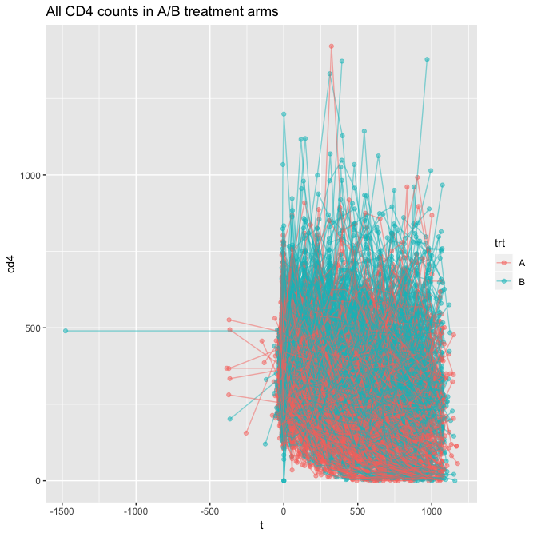
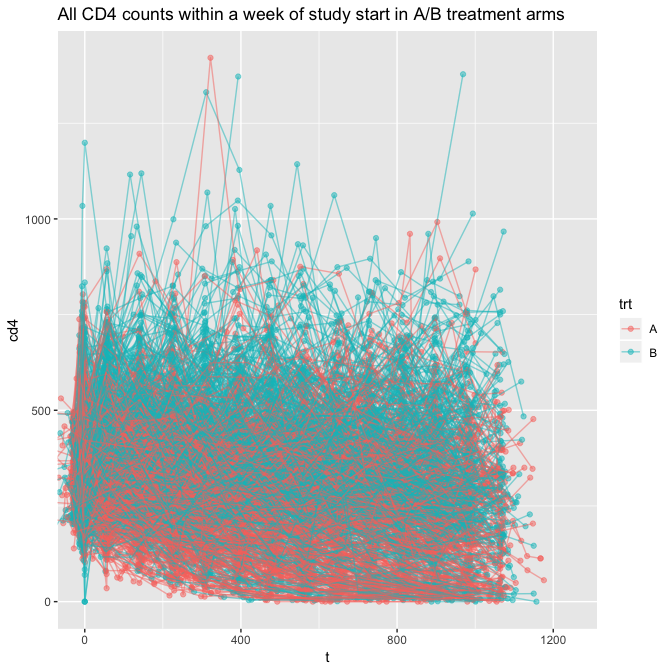
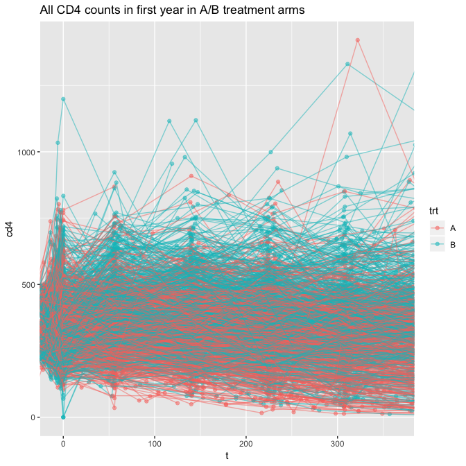
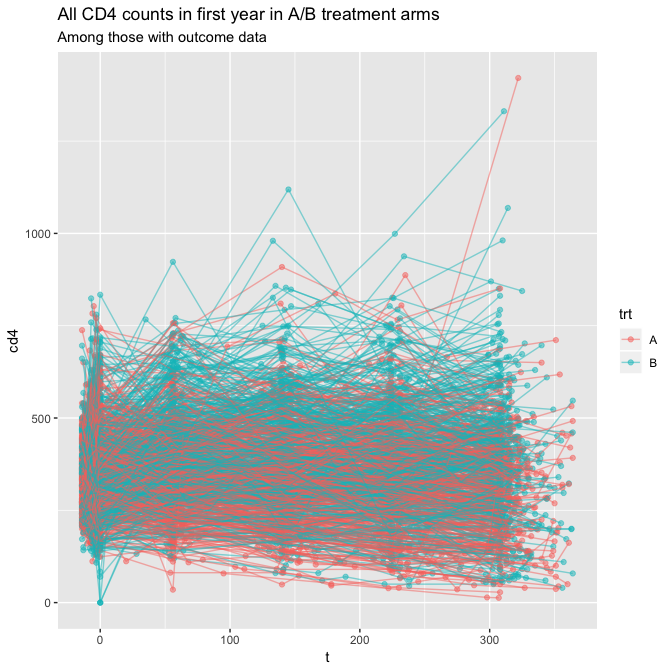
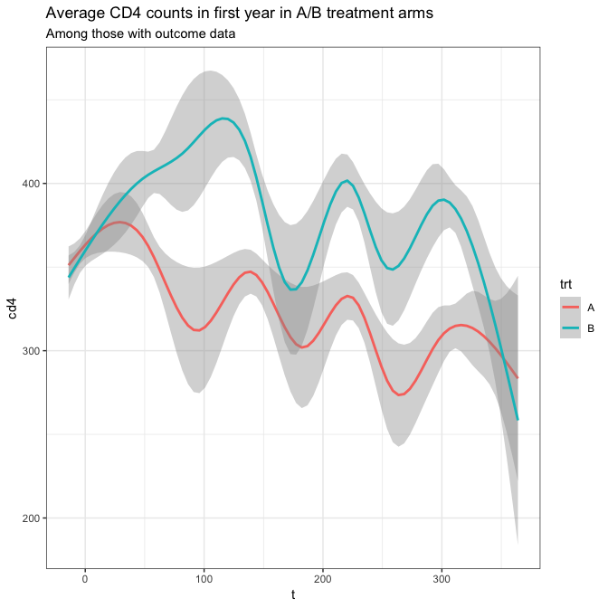

ACTG 175 data cleaning
================
dagniel
2019-04-23

``` r
library(knitr)
opts_chunk$set(warning = FALSE, message = FALSE, cache = FALSE, fig.width = 7, fig.height = 7)
```

``` r
library(tidyverse)
library(here)

bl <- read_csv(here(
  'data/data_for_denis/baseline.csv'
),
col_names = c(
  'pt_id',
  'age',
  'race_eth',
  'randomization_date',
  'site',
  'sex',
  'iv_drug_use',
  'hemophiliac',
  'homosexual',
  'screening_cd4',
  'avg_cd4',
  'base50',
  'wt_kg',
  'karnofsky_score',
  'arv_history_strat',
  'pre_arv_days',
  'zdv_30prior',
  'non_zdv_arv_prior',
  'zdv_prior175',
  'arv_history_binary',
  'symptomatic'),
col_types = cols(
  randomization_date = col_character(),
  pt_id = col_character(),
  race_eth = col_character(),
  site = col_character(),
  screening_cd4 = col_number(),
  avg_cd4 = col_number()
))

cd_data <- read_csv(
  here('data/data_for_denis/cd4.csv'),
  col_names = c('pt_id', 'cd4', 'date'),
  col_types = cols(
    cd4 = col_double(),
    pt_id = col_character(),
    date = col_date(format = '%d-%b-%y')
  )
)

status_data <- read_csv(
  here('data/data_for_denis/status.csv'),
  col_names = c('pt_id',
                'start_date',
                'crossover_date',
                'randomization_date',
                'off_treatment_date',
                'off_treatment_reason',
                'off_trt_reason_descr1',
                # 'off_trt_reason_descr2', ## this doesn't appear to be there.
                'off_study_date',
                'off_study_reason',
                'off_study_reason_descr',
                'death_date',
                'trt',
                'crossover_trt',
                'crossover_type',
                'exclude'),
  col_types = cols(
    pt_id = col_character(),
    start_date = col_date(format = '%d%b%y'),
    crossover_date = col_date(format = '%d%b%y'),
    randomization_date = col_date(format = '%d%b%y'),
    off_treatment_date = col_date(format = '%d%b%y'),
    off_study_date = col_date(format = '%d%b%y'),
    death_date = col_date(format = '%d%b%y')
  )
)
```

``` r
## full data
```

``` r
full_cohort <- bl %>%
  select(-randomization_date) %>%
  inner_join(status_data)
```

Make exclusions.

``` r
study_cohort <- full_cohort %>%
  filter(exclude == 'N',
         !is.na(avg_cd4))
study_cohort %>%
  count(trt)
```

    ## # A tibble: 4 x 2
    ##   trt       n
    ##   <chr> <int>
    ## 1 A       619
    ## 2 B       613
    ## 3 C       615
    ## 4 D       620

Comparing this table to Table 2 in the paper, it's clear that A = ZDV and B = ZDV + DID. Let's go with those and merge in the CD4 data.

``` r
comparison_data <- study_cohort %>%
  filter(trt %in% c('A', 'B')) %>%
  inner_join(cd_data) 
```

Set time zero to be `start_date`.

``` r
comparison_data <- comparison_data %>%
  mutate(t = date - start_date)

ggplot(comparison_data, aes(x = t, y = cd4, group = pt_id, color = trt)) +
  geom_point(alpha = 0.5) + 
  geom_line(alpha = 0.5) +
  ggtitle('All CD4 counts in A/B treatment arms')
```



``` r
ggplot(comparison_data, aes(x = t, y = cd4, group = pt_id, color = trt)) +
  geom_point(alpha = 0.5) + 
  geom_line(alpha = 0.5) +
  ggtitle('All CD4 counts within a week of study start in A/B treatment arms') +
  coord_cartesian(xlim = c(-7, 1250))
```



``` r
ggplot(comparison_data, aes(x = t, y = cd4, group = pt_id, color = trt)) +
  geom_point(alpha = 0.5) + 
  geom_line(alpha = 0.5) +
  ggtitle('All CD4 counts in first year in A/B treatment arms') +
  coord_cartesian(xlim = c(-7, 365.25))
```



Let's find a way to quantify the outcome. First, get all cd4 counts within 90 days of 3 years after study entry.

``` r
outcome_range <- comparison_data %>%
  filter(t > 365.25*3 - 90, t < 365.25*3 + 90)
```

Of the original 1232 patients in these two treatment arms, we have 319. That... is not a lot. Let's try 2 years.

``` r
outcome_range <- comparison_data %>%
  filter(t > 365.25*2 - 90, t < 365.25*2 + 90)
```

Of the original 1232 patients in these two treatment arms, now we have 887. That... is much better. Let's take the cd4 count that is closest to the 2-year mark as their outcome.

``` r
outcome_data <- outcome_range %>%
  mutate(twoyr_time_diff = abs(t - 365.25*2)) %>%
  group_by(pt_id) %>%
  summarise(yr2_cd4 = cd4[which.min(twoyr_time_diff)],
            cd4_diff = cd4[which.min(twoyr_time_diff)] - unique(avg_cd4))
```

Now let's find a baseline cd4 for each individual. Merge it back in and only use cd4 measurements between -14 days and 365 days after start date.

``` r
analysis_data <- comparison_data %>%
  inner_join(outcome_data) %>%
  filter(t >= -14, t <= 365)

ggplot(analysis_data, aes(x = t, y = cd4, group = pt_id, color = trt)) +
  geom_point(alpha = 0.5) + 
  geom_line(alpha = 0.5) +
  ggtitle('All CD4 counts in first year in A/B treatment arms',
          subtitle = 'Among those with outcome data')
```



``` r
ggplot(analysis_data, aes(x = t, y = cd4, color = trt)) +
  geom_smooth() +
  ggtitle('Average CD4 counts in first year in A/B treatment arms',
          subtitle = 'Among those with outcome data') +
  theme_bw()
```



We now have 5781 total observations on 887 patients.

``` r
clean_data <- analysis_data %>%
  transmute(id = pt_id,
            a = if_else(trt == 'B', 1, 0),
            tt = as.numeric(t),
            x = cd4,
            y = cd4_diff)
write_csv(clean_data,
          here('data/hiv-analysis-data.csv'))
```
