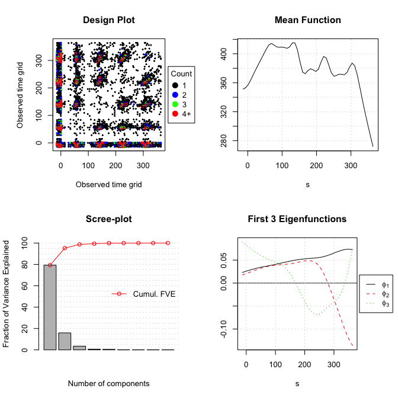
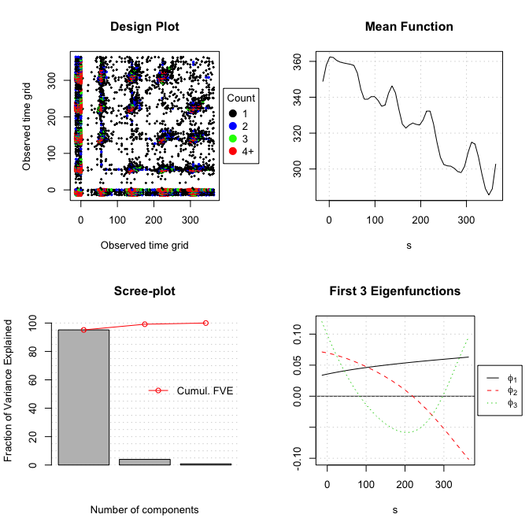
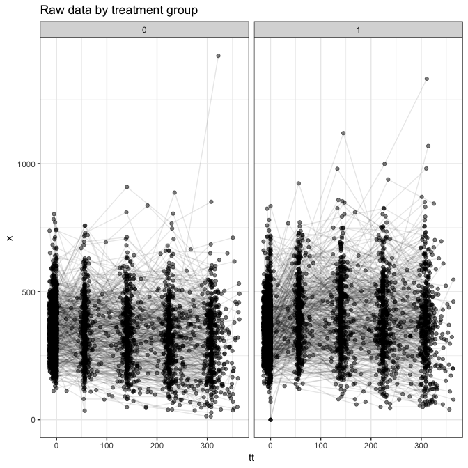
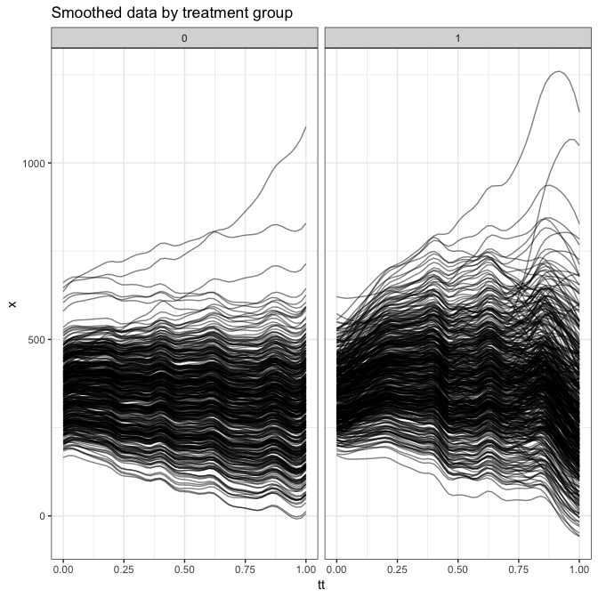

ACTG 175 analysis
================
dagniel
Tue Feb 26 13:24:20 2019

``` r
library(knitr)
opts_chunk$set(warning = FALSE, message = FALSE, cache = FALSE, fig.width = 7, fig.height = 7)
```

``` r
library(tidyverse)
library(here)
library(zeallot)
library(longsurr)
library(refund)
library(fda.usc)
select <- dplyr::select
analysis_data <- read_csv(
          here('data/hiv-analysis-data.csv'))

trt_ds <- analysis_data  %>%
  filter(a == 1)
ctrl_ds <- analysis_data %>%
  filter(a == 0)

n_trt <- trt_ds %>%
  summarise(n_trt = length(unique(id))) %>%
  pull(n_trt)
y_t <- trt_ds %>%
  select(id, y) %>%
  unique %>%
  pull(y)

n_ctrl <- ctrl_ds %>%
  summarise(n_ctrl = length(unique(id))) %>%
  pull(n_ctrl)
y_c <- ctrl_ds %>%
  select(id, y) %>%
  unique %>%
  pull(y)

c(trt_xhat_wide, ctrl_xhat_wide, trt_scores, ctrl_scores) %<-%
  presmooth_data(obs_data = analysis_data, n_trt = n_trt, n_ctrl = n_ctrl)
```



``` r
smoothed_data <- as_tibble(trt_xhat_wide, rownames = 'id') %>%
  mutate(a = 1) %>%
  full_join(
    as_tibble(ctrl_xhat_wide, rownames = 'id') %>%
      mutate(a = 0)
  ) %>%
  gather(tt, x, -id, -a) %>%
  mutate(tt = as.numeric(tt))


ggplot(analysis_data, aes(x = tt, y = x, group = id)) +
  geom_point(alpha = 0.5) +
  geom_line(alpha = 0.1) +
  facet_wrap(~ a) +
  theme_bw() +
  ggtitle('Raw data by treatment group')
```



``` r
ggplot(smoothed_data, aes(x = tt, y = x, group = id)) +
  geom_line(alpha = 0.5) +
  facet_wrap(~ a) +
  theme_bw() +
  ggtitle('Smoothed data by treatment group')
```



``` r
obs_lin_res <-
  fit_linear_model(y_t = y_t, y_c = y_c, X_t = trt_xhat_wide, X_c = ctrl_xhat_wide) %>%
  mutate(setting = 'obs_linear')
obs_lin_res
```

    ##      type         est        se    setting
    ## 1    mu_t -17.3298188  6.749559 obs_linear
    ## 2    mu_c -90.6560500  6.154977 obs_linear
    ## 3   mu_st -83.1004092 13.495051 obs_linear
    ## 4   mu_sc -20.3480898 16.103349 obs_linear
    ## 5   delta  73.3262311  9.134565 obs_linear
    ## 6 delta_s  65.7705904        NA obs_linear
    ## 7       R   0.1030414        NA obs_linear

``` r
obs_fgam_res <-
  fit_fgam(y_t = y_t, y_c = y_c, X_t = trt_xhat_wide, X_c = ctrl_xhat_wide) %>%
  mutate(setting = 'obs_fgam')
obs_fgam_res
```

    ##      type         est        se  setting
    ## 1    mu_t -17.3298188  6.749559 obs_fgam
    ## 2    mu_c -90.6560500  6.154977 obs_fgam
    ## 3   mu_st -80.0728245 17.752374 obs_fgam
    ## 4   mu_sc -24.5767162 17.638593 obs_fgam
    ## 5   delta  73.3262311  9.134565 obs_fgam
    ## 6 delta_s  62.7430056        NA obs_fgam
    ## 7       R   0.1443307        NA obs_fgam

``` r
obs_kernel_res <-
  fit_kernel_model(y_t = y_t, y_c = y_c, X_t = trt_xhat_wide, X_c = ctrl_xhat_wide) %>%
  mutate(setting = 'obs_kernel')
obs_kernel_res
```

    ##      type        est       se    setting
    ## 1    mu_t -17.329819 6.749559 obs_kernel
    ## 2    mu_c -90.656050 6.154977 obs_kernel
    ## 3   mu_st -27.628565 6.054545 obs_kernel
    ## 4   mu_sc -73.886779 5.983678 obs_kernel
    ## 5   delta  73.326231 9.134565 obs_kernel
    ## 6 delta_s  10.298746       NA obs_kernel
    ## 7       R   0.859549       NA obs_kernel
