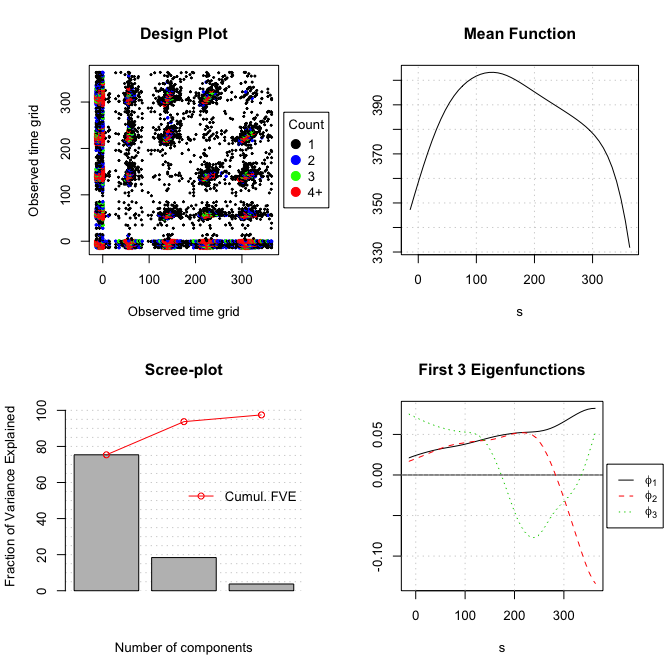
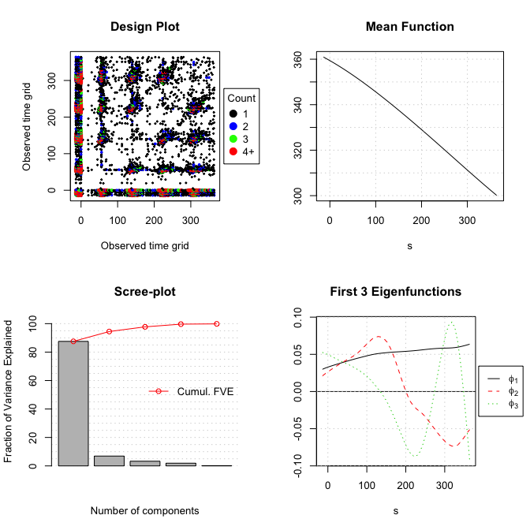
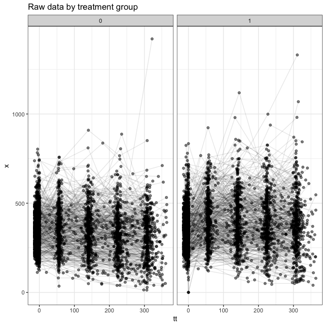
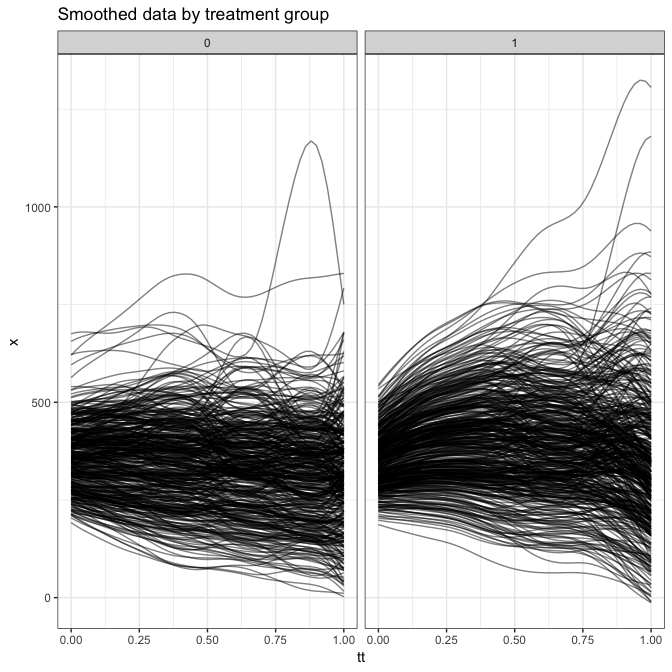

ACTG 175 analysis
================
dagniel
Wed Feb 27 10:26:56 2019

``` r
library(knitr)
opts_chunk$set(warning = FALSE, message = FALSE, cache = FALSE, fig.width = 7, fig.height = 7)
```

``` r
library(tidyverse)
library(here)
library(zeallot)
library(longsurr)
library(refund)
library(fda.usc)
select <- dplyr::select
analysis_data <- read_csv(
          here('data/hiv-analysis-data.csv'))

trt_ds <- analysis_data  %>%
  filter(a == 1)
ctrl_ds <- analysis_data %>%
  filter(a == 0)

n_trt <- trt_ds %>%
  summarise(n_trt = length(unique(id))) %>%
  pull(n_trt)
y_t <- trt_ds %>%
  select(id, y) %>%
  unique %>%
  pull(y)

n_ctrl <- ctrl_ds %>%
  summarise(n_ctrl = length(unique(id))) %>%
  pull(n_ctrl)
y_c <- ctrl_ds %>%
  select(id, y) %>%
  unique %>%
  pull(y)

c(trt_xhat_wide, ctrl_xhat_wide, trt_scores, ctrl_scores) %<-%
  presmooth_data(obs_data = analysis_data, 
                 n_trt = n_trt, n_ctrl = n_ctrl, 
                 options = 
                   list(plot = TRUE, 
                        # methodBwCov = 'GCV',
                        methodBwMu = 'CV',
                        methodSelectK = 'AIC',
                        useBinnedCov = FALSE,
                        verbose = FALSE))
```



``` r
smoothed_data <- as_tibble(trt_xhat_wide, rownames = 'id') %>%
  mutate(a = 1) %>%
  full_join(
    as_tibble(ctrl_xhat_wide, rownames = 'id') %>%
      mutate(a = 0)
  ) %>%
  gather(tt, x, -id, -a) %>%
  mutate(tt = as.numeric(tt))


ggplot(analysis_data, aes(x = tt, y = x, group = id)) +
  geom_point(alpha = 0.5) +
  geom_line(alpha = 0.1) +
  facet_wrap(~ a) +
  theme_bw() +
  ggtitle('Raw data by treatment group')
```



``` r
ggplot(smoothed_data, aes(x = tt, y = x, group = id)) +
  geom_line(alpha = 0.5) +
  facet_wrap(~ a) +
  theme_bw() +
  ggtitle('Smoothed data by treatment group')
```



``` r
obs_lin_res <-
  fit_linear_model(y_t = y_t, y_c = y_c, X_t = trt_xhat_wide, X_c = ctrl_xhat_wide) %>%
  mutate(setting = 'obs_linear')
obs_lin_res
```

    ##      type         est        se    setting
    ## 1    mu_t -17.3298188  6.749559 obs_linear
    ## 2    mu_c -90.6560500  6.154977 obs_linear
    ## 3   mu_st -76.9896178 12.139841 obs_linear
    ## 4   mu_sc  86.1905343 38.671165 obs_linear
    ## 5   delta  73.3262311  9.134565 obs_linear
    ## 6 delta_s  59.6597989        NA obs_linear
    ## 7       R   0.1863785        NA obs_linear

``` r
obs_fgam_res <-
  fit_fgam(y_t = y_t, y_c = y_c, X_t = trt_xhat_wide, X_c = ctrl_xhat_wide) %>%
  mutate(setting = 'obs_fgam')
obs_fgam_res
```

    ##      type         est           se  setting
    ## 1    mu_t -17.3298188 6.749559e+00 obs_fgam
    ## 2    mu_c -90.6560500 6.154977e+00 obs_fgam
    ## 3   mu_st -70.9373545 1.586920e+05 obs_fgam
    ## 4   mu_sc  94.8972088 2.891605e+01 obs_fgam
    ## 5   delta  73.3262311 9.134565e+00 obs_fgam
    ## 6 delta_s  53.6075356           NA obs_fgam
    ## 7       R   0.2689173           NA obs_fgam

``` r
obs_kernel_res <-
  fit_kernel_model(y_t = y_t, y_c = y_c, X_t = trt_xhat_wide, X_c = ctrl_xhat_wide) %>%
  mutate(setting = 'obs_kernel')
obs_kernel_res
```

    ##      type        est       se    setting
    ## 1    mu_t -17.329819 6.749559 obs_kernel
    ## 2    mu_c -90.656050 6.154977 obs_kernel
    ## 3   mu_st -28.882440 6.058854 obs_kernel
    ## 4   mu_sc -72.580346 6.139299 obs_kernel
    ## 5   delta  73.326231 9.134565 obs_kernel
    ## 6 delta_s  11.552621       NA obs_kernel
    ## 7       R   0.842449       NA obs_kernel
