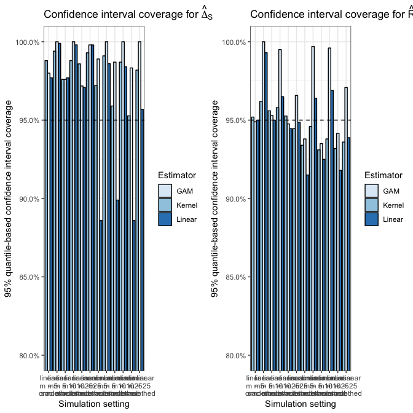
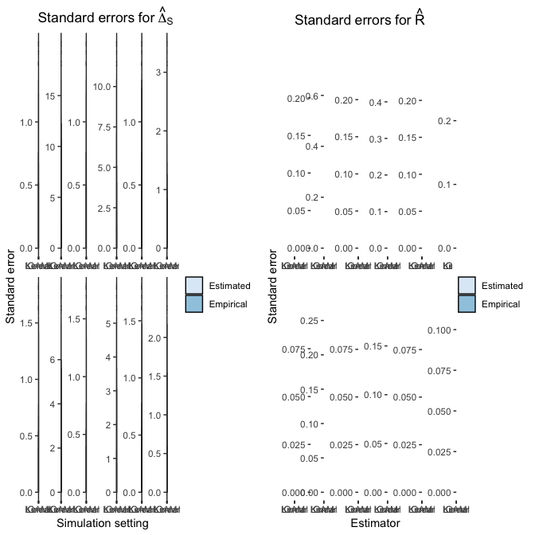

Make SE and CI plots
================
dagniel
2019-05-14

``` r
library(knitr)
opts_chunk$set(warning = FALSE, message = FALSE, cache = FALSE, fig.width = 7, fig.height = 7)
```

``` r
library(here)
library(glue)
library(tidyverse)
library(patchwork)
```

Pull in simulation results.

``` r
boot_res <- read_csv(here('results/boot-sim-results-prelim.csv'))
```

Get tru *R*s.

``` r
R_res <- boot_res %>%
  group_by(delta, m) %>%
  summarise(
    Delta_m = mean(deltahat), 
    Delta_l = unique(delta) + 5.812196,
    R_0 = unique(if_else(m == 'nonlinear', 1-delta/Delta_m, 1 - delta/Delta_l))
  )
```

Compute standard error results. Using means leads to wild values for many estimators. Using medians to summarize. Also, sometimes the Rsurrogate yields a missing value, so omitting those.

``` r
se_sum <- boot_res %>%
  inner_join(R_res) %>%
  group_by(n, n_i, m, s_x, s_y, delta, estimator, type) %>%
  summarise(Deltahat_se_boot = median(sqrt(var_delta), na.rm = TRUE),
            Deltahat_se_emp = sd(deltahat, na.rm = TRUE),
            Deltahat_s_se_boot = median(sqrt(var_delta_s), na.rm = TRUE),
            Deltahat_s_se_emp = sd(delta_s, na.rm = TRUE),
            R_se_boot = median(sqrt(var_R), na.rm = TRUE),
            R_se_emp = sd(R, na.rm = TRUE),
            nsim = length(unique(run))) %>%
  ungroup %>%
  mutate(estimator = str_remove(estimator, 'delta_s_')) %>%
  select(-s_x, -s_y)
```

Compute confidence interval coverage.

``` r
ci_sum <- boot_res %>%
  inner_join(R_res) %>%
  group_by(n, n_i, m, s_x, s_y, delta, estimator, type) %>%
  summarise(Deltahat_s_bias = mean(delta_s - delta, na.rm = TRUE),
            Deltahat_s_ci_n = mean(delta_s - 1.96*sqrt(var_delta_s) < delta &
                                     delta_s + 1.96*sqrt(var_delta_s) > delta, na.rm = TRUE),
            Deltahat_s_ci_q = mean(low_q_delta_s < delta &
                                     high_q_delta_s > delta, na.rm = TRUE),
            R_bias = mean(R - R_0, na.rm = TRUE),
            R_ci_n = mean(R - 1.96*sqrt(var_R) < R_0 &
                            R + 1.96*sqrt(var_R) > R_0, na.rm = TRUE),
            R_ci_q = mean(low_q_R < R_0 &
                            high_q_R > R_0, na.rm = TRUE),
            nsim = length(unique(run))) %>%
  ungroup %>%
  mutate(estimator = str_remove(estimator, 'delta_s_')) %>%
  select(-s_x, -s_y)
```

Get SE results for $\\widehat{\\Delta}\_S$ and plot.

``` r
deltahat_se_sum <- 
  se_sum %>%
  filter(!estimator %in% c('change', 'mean', 'lin', 'fgam'),
         delta == 25) %>%
  select(-R_se_boot, -R_se_emp, -Deltahat_se_boot, -Deltahat_se_emp) %>%
  gather(key, value, Deltahat_s_se_emp, Deltahat_s_se_boot) %>%
  mutate(setting = glue('{m}\nm = {n_i}\n{type}'),
         est = case_when(
           estimator == 'k' ~ 'Kernel',
           estimator == 'kfgam' ~ 'GAM',
           estimator == 'klin' ~ 'Linear'
         )) %>%
  arrange(m, n, n_i) %>%
  mutate(setting = fct_inorder(setting))
dse_pl <- ggplot(deltahat_se_sum,
       aes(x = est, y = value, group = key, fill = key)) +
  geom_col(position = 'dodge', color = 'black') +
  facet_wrap(~setting, scales = 'free', ncol = 6) +
  theme_bw() +
  labs(x = 'Simulation setting', y = 'Standard error') +
  scale_fill_brewer('', labels = c('Estimated', 'Empirical')) +
  ggtitle(expression(Standard~errors~'for'~hat(Delta)[S]))


R_se_sum <- 
  se_sum %>%
  filter(!estimator %in% c('change', 'mean', 'lin', 'fgam'),
         delta == 25) %>%
  select(-Deltahat_s_se_emp, -Deltahat_s_se_boot, -Deltahat_se_boot, -Deltahat_se_emp) %>%
  gather(key, value, R_se_boot, R_se_emp) %>%
  mutate(setting = glue('{m}\nm = {n_i}\n{type}'),
         est = case_when(
           estimator == 'k' ~ 'Kernel',
           estimator == 'kfgam' ~ 'GAM',
           estimator == 'klin' ~ 'Linear'
         )) %>%
  arrange(m, n, n_i) %>%
  mutate(setting = fct_inorder(setting))
rse_pl <- ggplot(R_se_sum,
       aes(x = est, y = value, group = key, fill = key)) +
  geom_col(position = 'dodge', color = 'black') +
  facet_wrap(~setting, scales = 'free', ncol = 6) +
  theme_bw() +
  labs(x = 'Estimator', y = 'Standard error') +
  scale_fill_brewer('', labels = c('Estimated', 'Empirical')) +
  ggtitle(expression(Standard~errors~'for'~hat(R)))

boot_res %>%
filter(!estimator %in% c('delta_s_change', 'delta_s_mean', 'delta_s_lin', 'delta_s_fgam'))%>% sample_n(5) %>% select(estimator, type, R, var_R, n:delta)
```

    ## # A tibble: 5 x 10
    ##   estimator    type        R    var_R     n   n_i m         s_x   s_y delta
    ##   <chr>        <chr>   <dbl>    <dbl> <dbl> <dbl> <chr>   <dbl> <dbl> <dbl>
    ## 1 delta_s_k    smoot…  0.162  1.61e+2    50    10 linear      1     1     5
    ## 2 delta_s_k    oracle  0.573  3.49e+1    50    25 linear      1     1     5
    ## 3 delta_s_kfg… oracle -0.196  5.08e-1    50    25 linear      1     1    25
    ## 4 delta_s_klin oracle  0.384  8.27e-3    50    10 nonlin…     1     1    25
    ## 5 delta_s_klin smoot…  0.115  3.57e-1    50    25 nonlin…     1     1     5

``` r
deltahat_ci_sum <- ci_sum %>%
  filter(!estimator %in% c('change', 'mean', 'lin', 'fgam'),
         delta == 25) %>%
  mutate(setting = glue('{m}\nm = {n_i}\n{type}'),
         est = case_when(
           estimator == 'k' ~ 'Kernel',
           estimator == 'kfgam' ~ 'GAM',
           estimator == 'klin' ~ 'Linear'
         )) %>%
  arrange(m, n, n_i) %>%
  mutate(setting = fct_inorder(setting))
dci_qpl <- ggplot(deltahat_ci_sum,
       aes(x = setting, y = Deltahat_s_ci_q, fill = est, group = estimator)) +
  geom_col(position = 'dodge', color = 'black') +
  theme_bw() +
  geom_hline(aes(yintercept = 0.95), linetype = 2) +
  coord_cartesian(ylim = c(0.8, 1)) +
  scale_fill_brewer('Estimator') +
  ggtitle(expression(Confidence~interval~coverage~'for'~hat(Delta)[S])) +
  scale_y_continuous(labels = scales::percent) +
  labs(x = 'Simulation setting', y = '95% quantile-based confidence interval coverage')

dci_npl <- ggplot(deltahat_ci_sum,
       aes(x = setting, y = Deltahat_s_ci_n, fill = est, group = estimator)) +
  geom_col(position = 'dodge', color = 'black') +
  theme_bw() +
  geom_hline(aes(yintercept = 0.95), linetype = 2) +
  coord_cartesian(ylim = c(0.8, 1)) +
  scale_fill_brewer('Estimator') +
  ggtitle(expression(Confidence~interval~coverage~'for'~hat(Delta)[S])) +
  scale_y_continuous(labels = scales::percent) +
  labs(x = 'Simulation setting', y = '95% normal-based confidence interval coverage')

R_ci_sum <- ci_sum %>%
  filter(!estimator %in% c('change', 'mean', 'lin', 'fgam'),
         delta == 25) %>%
  mutate(setting = glue('{m}\nm = {n_i}\n{type}'),
         est = case_when(
           estimator == 'k' ~ 'Kernel',
           estimator == 'kfgam' ~ 'GAM',
           estimator == 'klin' ~ 'Linear'
         )) %>%
  arrange(m, n, n_i) %>%
  mutate(setting = fct_inorder(setting))
rci_qpl <- ggplot(R_ci_sum,
       aes(x = setting, y = R_ci_q, fill = est, group = estimator)) +
  geom_col(position = 'dodge', color = 'black') +
  theme_bw() +
  geom_hline(aes(yintercept = 0.95), linetype = 2) +
  coord_cartesian(ylim = c(0.8, 1)) +
  scale_fill_brewer('Estimator') +
  ggtitle(expression(Confidence~interval~coverage~'for'~hat(R))) +
  scale_y_continuous(labels = scales::percent) +
  labs(x = 'Simulation setting', y = '95% quantile-based confidence interval coverage')

rci_npl <- ggplot(R_ci_sum,
       aes(x = setting, y = R_ci_n, fill = est, group = estimator)) +
  geom_col(position = 'dodge', color = 'black') +
  theme_bw() +
  geom_hline(aes(yintercept = 0.95), linetype = 2) +
  coord_cartesian(ylim = c(0.8, 1)) +
  scale_fill_brewer('Estimator') +
  ggtitle(expression(Confidence~interval~coverage~'for'~hat(R))) +
  scale_y_continuous(labels = scales::percent) +
  labs(x = 'Simulation setting', y = '95% normal-based confidence interval coverage')

dci_qpl + rci_qpl
```



``` r
ggsave(here('results/quantile-ci-figure.png'), width = 18, height = 8)

dse_pl + rse_pl
```



``` r
ggsave(here('results/standard-error-figure.png'), width = 22, height = 8)
```
